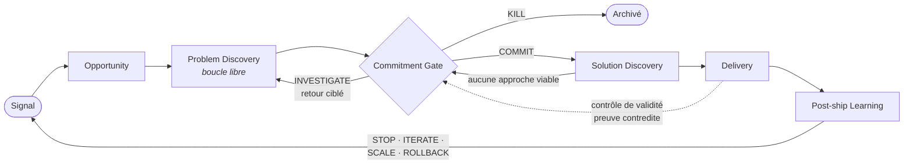

# Product OS

**From signals to product decisions — explicit, traceable, reproducible.**

Les décisions produit se prennent souvent vite, sans preuves consolidées ni trace du raisonnement qui les a motivées — au risque de refaire les mêmes erreurs, ou de ne plus savoir pourquoi un choix a été fait.

Product OS améliore la qualité, la traçabilité et la reproductibilité des décisions produit.

C'est un modèle de pilotage produit — 7 phases, une décision explicite à chaque étape, une mémoire persistante — exécuté par 15 capacités agentiques dans Claude Code.

*(Une capacité — ou "skill" dans Claude Code — est une instruction structurée et versionnée dans ce repository : un moyen d'exécuter une décision du modèle, pas une fin en soi.)*

## Pour qui

- **Product Manager** — pilote une initiative de bout en bout, du signal au post-ship.
- **Product Leader / Head of Product** — évalue un modèle de décision produit à adopter par son équipe.
- **CPO** — cherche une architecture de gouvernance (gates, preuves, mémoire) transposable à son organisation.
- **Équipe produit** — veut adopter progressivement, une capacité à la fois.

## Cible actuelle

**PM solo.** Product OS est conçu et validé en priorité pour un Product Manager qui opère seul sur son produit. Le modèle est pensé pour rester partageable et pouvoir évoluer vers un usage en équipe, mais les workflows collaboratifs complets ne sont pas encore validés.

## Le modèle de pilotage produit

Signaux → Opportunité → Problem Discovery → Commitment Gate → Solution Discovery → Delivery → Post-ship Learning → nouveaux signaux



Pas un pipeline strictement linéaire : la Problem Discovery se déroule en boucle libre, `INVESTIGATE` ramène de façon ciblée vers la discovery, et des contrôles de validité en delivery peuvent rouvrir un engagement déjà pris. Inspiré librement du Double Diamond — diverger puis converger, deux fois, sur le problème puis sur la solution — sans en être une reproduction exacte : le système comporte davantage de gates et de boucles que deux losanges symétriques.

## Le modèle, phase par phase

| Phase | Décision produite | Question produit | Preuves mobilisées | Capacités associées |
|---|---|---|---|---|
| **Signal** | — | — | Signal brut (retour client, donnée produit, move concurrent), pas encore qualifié | *point d'entrée* |
| **Opportunity** | Go / no-go / à monitorer, priorisation entre opportunités | Ce signal sert-il une opportunité alignée avec notre stratégie ? | Analyse concurrentielle, sizing, alignement stratégique | `/pm-market-analysis`, `/pm-prioritize` |
| **Problem Discovery** | Preuves de valeur consolidées, prêtes pour l'engagement | Le problème, le segment et l'espace de solutions possibles sont-ils compris ? | Verbatims, écarts dit/fait, personas, parcours | `/pm-interview-insights`, `/pm-ux-personas`, `/pm-journey-mapping` |
| **Commitment Gate** | `KILL` / `INVESTIGATE` / `COMMIT` | A-t-on assez appris pour s'engager ? | Confiance globale, fit stratégique | `/pm-commitment-gate` |
| **Solution Discovery** | Approche retenue, alternatives écartées avec raison | Quelle approche atteint l'outcome au meilleur rapport risque/impact ? | Hypothèses d'utilisabilité, de faisabilité, de viabilité, par approche | `/pm-success-metrics`, `/pm-solution-exploration` |
| **Delivery** | Consolider l'engagement (PRD `approved`) → arbitrer le scope → valider l'expérience (quality gate) → rendre l'exécution actionnable (tickets) | Le dossier est-il prêt, et comment se découpe-t-il en exécution ? | Hypothèses restantes, quality gates, tradeoffs arbitrés | `/pm-prd`, `/pm-scope`, `/pm-prototype`, `/pm-tickets` |
| **Post-ship Learning** | `STOP` / `ITERATE` / `SCALE` / `ROLLBACK` | Les résultats réels confirment-ils l'engagement initial ? | Adoption, activation, rétention, feedback, impact économique | `/pm-release`, `/pm-data-analysis` |

Delivery n'est pas une étape unique : c'est une séquence de 4 décisions (consolider l'engagement → arbitrer le scope → valider l'expérience → rendre l'exécution actionnable), pas une boîte noire entre le PRD et les tickets.

`/pm-sprint-plan` est une capacité annexe optionnelle (planification dans le temps), hors de ce modèle par nature.

## Les décisions du système

| Famille | Phase | Valeurs |
|---|---|---|
| Engagement | Commitment Gate | `KILL` arrêter, archiver la raison · `INVESTIGATE` poursuivre une investigation ciblée · `COMMIT` engager la delivery |
| Apprentissage | Post-ship Learning | `STOP` ne pas retirer, ne plus investir · `ITERATE` ajuster et retester · `SCALE` déployer plus largement · `ROLLBACK` retirer |

## Trois couches, à ne pas confondre

Le modèle de pilotage produit décrit des décisions. Les capacités du Product OS permettent de les exécuter. Les outils — Claude Code, Pencil, Linear, GitHub — sont des implémentations actuelles de ces capacités, remplaçables sans changer le modèle.

```
                        Product OS
                             │
              Modèle de pilotage produit
                             │
          ┌──────────────────┼──────────────────┐
          │                  │                  │
       Signals      Product Knowledge        Outcomes
                  (product-facts · product-strategy
                   · evidence-register · decision-log)
                             │
                  15 capacités (`/pm-*`)
                             │
                       Claude Code
                             │
              Pencil · Linear · GitHub
```

### La mémoire produit (Product Knowledge)

- `product-facts.md` — faits et connaissances considérés comme vrais sur le produit
- `product-strategy.md` — cap, principes et contraintes stratégiques
- `evidence-register.md` — hypothèses, preuves, niveaux d'incertitude et contradictions
- `decision-log.md` — décisions prises, raisons et conséquences

Ces quatre fichiers permettent aux capacités de reprendre le contexte existant, de mettre à jour les preuves, et de conserver la trace des arbitrages — jamais de deviner une information manquante. Détail complet : [`tools/product-os/index.md`](tools/product-os/index.md) § Structure des fichiers.

## Où commencer

**Encore un doute entre les premières commandes ?**

- Signal brut ou évolution de marché, rien d'identifié encore → `/pm-market-analysis`
- Plusieurs opportunités déjà identifiées, à comparer → `/pm-prioritize`
- Une opportunité déjà instruite, décision d'investissement à prendre → `/pm-commitment-gate`
- Solution déjà engagée (post-`COMMIT`), à cadrer et livrer → `/pm-prd`

**Par phase du modèle** — cf. le tableau ci-dessus.

**Par besoin** — vous savez ce que vous voulez faire :

| Besoin | Capacité |
|---|---|
| Évaluer si un signal constitue une opportunité | `/pm-market-analysis` |
| Décider quelle opportunité poursuivre en premier | `/pm-prioritize` |
| Valider le problème, le segment ou le parcours utilisateur | `/pm-interview-insights`, `/pm-ux-personas`, `/pm-journey-mapping` |
| Décider d'investir | `/pm-commitment-gate` |
| Définir l'outcome, choisir l'approche, arbitrer le dossier | `/pm-success-metrics`, `/pm-solution-exploration`, `/pm-prd` |
| Valider qu'une solution est prête pour le développement | `/pm-prototype` |
| Découper le travail et le rendre exécutable | `/pm-scope`, `/pm-tickets`, `/pm-sprint-plan` |
| Décider de la suite après lancement | `/pm-release`, `/pm-data-analysis` |

**Par niveau de lecture** :

| Niveau | Fichier |
|---|---|
| Modèle (< 5 min) | Ce README |
| Opératoire (pipeline détaillé, statuts, gouvernance, glossaire) | [`tools/product-os/index.md`](tools/product-os/index.md) |
| Détaillé (une décision précise) | Chaque `.claude/skills/pm-*.md` |

## Exemple

[`examples/onboarding-saas/`](examples/onboarding-saas/) — un cas fictif mais réaliste qui traverse Commitment Gate → Solution Discovery → PRD (première décision de Delivery), et montre comment chaque fichier hérite de ce que le précédent a tranché, sans le redéfinir. Le reste de Delivery (scope, prototype, tickets) et le Post-ship ne sont pas encore couverts par cet exemple.

## Pourquoi Product OS

La plupart des workflows "PM + IA" automatisent la rédaction de documents. Product OS orchestre un raisonnement produit complet : décider avant d'exécuter, séparer faits et hypothèses, conserver le raisonnement derrière les décisions, bloquer les handoffs quand les preuves manquent, fermer la boucle après le lancement.

Détail du format commun aux 15 capacités (Décision, Entrées, Sortie, Bloque si, Met à jour) : [`tools/product-os/index.md`](tools/product-os/index.md) § Header standardisé des skills.

## Démarrage

### 1. Cloner le repository

```bash
git clone https://github.com/Romai558/product-os.git
cd product-os
```

Il est aussi possible de copier uniquement `.claude/skills/` et `tools/product-os/` dans un projet Claude Code existant.

### 2. Initialiser le contexte produit

Compléter `tools/product-os/context/product-facts.md` et `product-strategy.md`. Toute information inconnue reste marquée `[à documenter]`.

### 3. Lancer une première initiative

À partir d'un signal réel : `/pm-market-analysis`, ou directement `/pm-prioritize` si plusieurs opportunités sont déjà identifiées.

Le détail complet du pipeline et des règles se trouve dans [`tools/product-os/index.md`](tools/product-os/index.md).

## Vérifier la cohérence

```bash
python3 tools/product-os/lint-pm-skills.py
```

Tourne aussi automatiquement en CI sur chaque push et pull request ([`.github/workflows/lint.yml`](.github/workflows/lint.yml)). Détail de ce que le linter vérifie et comment annoter une exception volontaire : [`CONTRIBUTING.md`](CONTRIBUTING.md).

## Statut

**v1 expérimentale** — architecture stabilisée, actuellement en validation par usage réel. Toute évolution suit une gouvernance stricte (Observation → Problème → Hypothèse → Évolution) — détail : [`tools/product-os/index.md`](tools/product-os/index.md) § Gouvernance des évolutions.

## Influences

Product OS s'appuie notamment sur :

- **Teresa Torres** — Continuous Discovery et Opportunity-Solution Trees
- **Marty Cagan** — Value, Usability, Feasibility, Viability risks
- **Gibson Biddle** — DHM : Delight, Hard-to-copy, Margin-enhancing
- **[phuryn/pm-skills](https://github.com/phuryn/pm-skills)** — plusieurs patterns opérationnels PM

L'historique des décisions d'architecture est disponible dans [`CHANGELOG.md`](CHANGELOG.md).

## Licence

MIT — voir [`LICENSE`](LICENSE).
